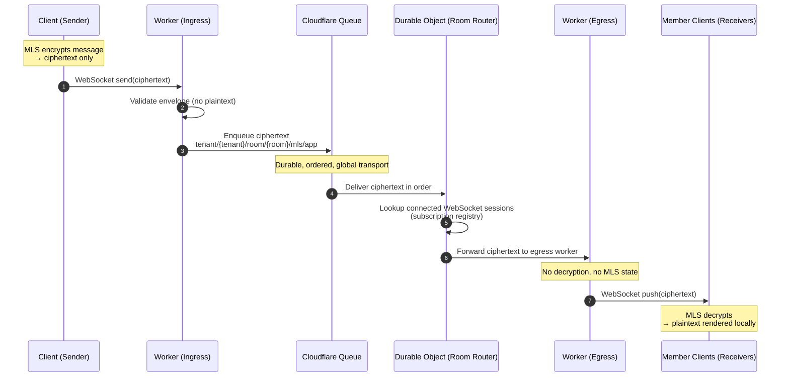

# tunnl3d Architecture Specification  
Version: 2.1 (Cloudflare‑Native, Client‑Governed MLS)  
Revised: Client‑Side Quorum, Encrypted Metadata, Zero‑Trust Infrastructure, R2 Message History

This document defines the tunnl3d architecture as a **zero‑API, MLS‑secure, server‑blind messaging platform** built on Cloudflare’s global edge network.  
All cryptographic authority resides in **clients**, not servers.  
Cloudflare provides **transport, routing, ordering, and persistence**, but never sees plaintext or group semantics.

---

# 1. High‑Level Overview

tunnl3d is composed of:

- **Cloudflare Workers** — ingress/egress, routing, validation of message envelopes  
- **Cloudflare Queues** — ordered, durable transport for MLS control and quorum updates  
- **Cloudflare Durable Objects (DOs)** — blind coordination substrate for:
  - encrypted quorum state  
  - encrypted room metadata  
  - proposal lifecycle  
  - routing and ordering  
- **Cloudflare KV / R2** — optional encrypted blob storage  
- **Stripe** — billing + tenant identity oracle  
- **Clients (WASM + MAUI)** — MLS core, encryption, quorum logic, UI, onboarding, recovery

Key properties:

- **No server‑side MLS state**  
- **No server‑side plaintext**  
- **No server‑side authority**  
- **Client‑side quorum governs membership**  
- **All sensitive metadata encrypted with MLS‑derived keys**  
- **Cloudflare is fully untrusted and replaceable**

---

# 2. Data Plane: Workers + Queues

The data plane handles all ciphertext transport.

## 2.1 Application Messages

- Clients encrypt messages using MLS application keys.  
- Workers receive ciphertext over WebSockets/HTTP.  
- Workers enqueue messages into Queues for fan‑out.  
- Other Workers deliver ciphertext to subscribed clients.  
- No plaintext is visible to Cloudflare.

Topics:

    tenant/{tenant_id}/room/{room_id}/mls/app

Properties:

- No message history stored server‑side  
- No plaintext  
- No handle or identity leakage  
- High‑throughput, low‑latency global delivery

---

# 3. Control Plane: Workers + Queues + Durable Objects

The control plane handles:

- MLS control messages  
- Quorum‑based membership changes  
- Encrypted room metadata  
- Proposal lifecycle  

## 3.1 MLS Control Messages

Flow:

1. Client publishes MLS control envelope (proposal, commit, GroupInfo).  
2. Worker validates envelope structure (not cryptography).  
3. Worker enqueues into Queue.  
4. DO processes ordered control messages:
   - updates encrypted metadata  
   - stores encrypted quorum state  
   - routes commit notifications  

DO never sees plaintext or MLS secrets.

Topics:

    tenant/{tenant_id}/room/{room_id}/mls/control

---

# 4. Governance Plane: Client‑Side Quorum

tunnl3d uses **client‑side quorum** for all structural changes:

- add member  
- remove member  
- change room configuration  
- change approver set  
- change quorum threshold  

## 4.1 Approver Set (A)

- Defined per room  
- Typically 3–7 members (normal)  
- 5–9 members (high‑security)  

## 4.2 Quorum Threshold (k)

Default:

    If |A| ≤ 3         → k = 2  
    If |A| ∈ [4,5]     → k = 3  
    If |A| ≥ 6         → k = ceil(2/3 * |A|)

Whole‑group mode (optional):

    k = max(3, ceil(0.2 * n))

## 4.3 Quorum State

All quorum state is:

- constructed client‑side  
- encrypted with MLS‑derived storage keys  
- stored as opaque blobs in DOs  
- never visible to Cloudflare  

Clients:

- fetch encrypted quorum state  
- decrypt  
- verify approvals  
- detect quorum  
- publish MLS commits  

Cloudflare never knows:

- who approved  
- how many approved  
- when quorum is reached  

---

# 5. Metadata Plane: Encrypted Durable Object Storage

Durable Objects store:

- encrypted room metadata  
- encrypted quorum state  
- encrypted admin payloads  
- routing metadata (plaintext)  

## 5.1 MLS‑Derived Storage Keys

Clients derive storage keys using MLS exporter:

Stable key (default):

    K_storage = MLS-Exporter("tunnl3d-do-metadata", "group-creation", 32)

Per‑epoch key (high‑security):

    K_storage(E) = MLS-Exporter("tunnl3d-do-metadata", "epoch-" || E, 32)

## 5.2 Encrypted Metadata

Encrypted:

- room name  
- description  
- roles  
- admin notes  
- display attributes  
- any sensitive configuration  

Plaintext (required for routing):

- tenant_id  
- room_id  
- pseudonym_id  
- proposal_id  
- Queue pointers  

Cloudflare cannot decrypt any metadata.

---

# 6. Onboarding: Two‑Phase, Client‑Side Handles, Encrypted Payloads

Onboarding remains:

- two‑phase  
- client‑encrypted  
- server‑blind  

## 6.1 Phase 1 — Client Acceptance

Client sends:

- slot_id  
- onboarding_public_key  
- optional invite challenge  

Workers/DOs:

- validate slot_id  
- store onboarding_public_key  
- never see handles or PII  

## 6.2 Phase 2 — Admin Completion

Admin encrypts:

- handle  
- pseudonym_id  
- display attributes  

…to the onboarding_public_key.

DO stores ciphertext only.

## 6.3 Phase 3 — Client Finalisation

Client decrypts admin payload and joins MLS group.

Server never sees:

- handle  
- mapping  
- onboarding secrets  

---

# 7. Tenant Identity: Stripe as Oracle

Stripe stores:

- tenant_id  
- tenant_hmac  
- tenant_recovery_id  

Workers validate:

1. Stripe webhook signature  
2. tenant_hmac = HMAC(secret, tenant_id)  

No PII stored in tunnl3d.

---

# 8. Recovery: Encrypted Blobs

Recovery blobs contain:

- admin keys  
- pseudonym mappings  
- bootstrap metadata  

Encrypted client‑side with recovery key.

Stored in DO or R2 as ciphertext.

Server never sees decrypted recovery data.

---

# 9. Security Properties

## 9.1 End‑to‑End Encryption

- MLS encrypts all application messages  
- Only clients hold keys  
- Cloudflare sees ciphertext only  

## 9.2 Zero‑Trust Infrastructure

Cloudflare cannot:

- decrypt messages  
- decrypt metadata  
- forge approvals  
- detect quorum  
- add ghost members  
- remove members  
- rewrite history  

## 9.3 Client‑Side Governance

- Quorum enforced cryptographically  
- DO is blind  
- State actor must compromise k clients  

## 9.4 Metadata Confidentiality

- All semantic metadata encrypted  
- Only routing identifiers plaintext  

## 9.5 Forward Secrecy & PCS

MLS provides:

- forward secrecy  
- post‑compromise security  
- epoch‑based key rotation  

---

# 10. Operational Model

## 10.1 Cloudflare Responsibilities

- Transport  
- Routing  
- Ordering  
- Persistence  
- Stripe webhook ingress  
- Zero plaintext handling  

## 10.2 Client Responsibilities

- MLS core  
- Encryption/decryption  
- Quorum logic  
- Metadata encryption  
- Onboarding crypto  
- Recovery crypto  
- UI  

## 10.3 No Server‑Side AS

All authority resides in clients.

Cloudflare is a **stateless, untrusted substrate**.

---

# 11. Data Flow



---

# 12. Summary

tunnl3d on Cloudflare is:

- **Zero‑trust**  
- **Zero‑plaintext**  
- **Zero‑API**  
- **Client‑governed**  
- **Cryptographically self‑authenticating**  
- **Economically minimal**  
- **Resilient to state‑actor coercion**  

Cloudflare provides global transport and coordination.  
Clients provide all cryptographic correctness and governance.

This architecture achieves maximal privacy, maximal resilience, and minimal operational cost.

---

# 13. Message History & Client Reconnection

## 13.1 R2 Message History

All messages are persisted to R2 for client replay on reconnection.

### Architecture

```
┌─────────────┐     ┌─────────────┐     ┌─────────────┐
│  Ingress    │────▶│ MLS_QUEUE   │────▶│  Room DO    │──▶ WebSocket broadcast
└─────────────┘     └─────────────┘     └─────────────┘
                           │
                           ▼
                    ┌─────────────┐
                    │ R2 Bucket   │
                    │ (history)   │
                    └─────────────┘
```

### R2 Key Structure

```
messages/{tenant_id}/{room_id}/{YYYY-MM-DD}/{timestamp}-{message_id}.json
```

Example:
```
messages/tenant-123/room-456/2024-12-23/1703337600000-msg-abc123.json
```

### Message Object Format

```json
{
  "id": "msg-abc123",
  "timestamp": "2024-12-23T12:00:00.000Z",
  "sequence": 42,
  "envelope": {
    "type": "mls_app",
    "tenantId": "tenant-123",
    "roomId": "room-456",
    "pseudonymId": "user-789",
    "sequence": 42,
    "timestamp": "2024-12-23T12:00:00.000Z",
    "ciphertext": "base64-encoded-encrypted-content"
  }
}
```

### Storage Properties

| Property | Value |
|----------|-------|
| Cost | $0.015/GB/month |
| Max object size | 5 TB |
| Default retention | 30 days |
| Auto-expiration | Lifecycle policy |

### Write Flow

1. Queue consumer receives message from MLS_QUEUE
2. **Before** delivering to Room DO, writes to R2:
   ```typescript
   await env.MESSAGE_HISTORY.put(
     `messages/${tenantId}/${roomId}/${date}/${timestamp}-${id}.json`,
     JSON.stringify(historyEntry)
   );
   ```
3. Delivers message to Room DO for WebSocket broadcast
4. Acknowledges queue message

This ensures **strong consistency**: message is in R2 before delivery is confirmed.

---

## 13.2 Client Reconnection Flow

When a client reconnects after being offline, it must fetch missed messages before resuming real-time delivery.

### Client State Tracking

Clients must persist locally:

```typescript
interface ClientRoomState {
  tenantId: string;
  roomId: string;
  lastSequence: number;        // Last received sequence number
  lastTimestamp: string;       // ISO 8601 timestamp of last message
  lastMessageId: string;       // ID of last received message
}
```

### Reconnection Sequence

```
Client                      Cloudflare                         R2
   │                            │                               │
   │  1. Request missed messages                                │
   │──GET /api/v1/history──────▶│                               │
   │   ?tenant=xxx              │                               │
   │   &room=yyy                │                               │
   │   &since=2024-12-23T10:00  │                               │
   │   &sequence=42             │                               │
   │                            │                               │
   │                            │  2. List objects by prefix    │
   │                            │──list(prefix)────────────────▶│
   │                            │◀──object keys─────────────────│
   │                            │                               │
   │                            │  3. Fetch message objects     │
   │                            │──get(key)────────────────────▶│
   │                            │◀──message JSON────────────────│
   │                            │                               │
   │  4. Return messages        │                               │
   │◀──{"messages":[...]}───────│                               │
   │                            │                               │
   │  5. Process missed messages (MLS decrypt)                  │
   │                            │                               │
   │  6. Reconnect WebSocket    │                               │
   │──GET /ws/:tenant/:room────▶│                               │
   │◀──101 Switching Protocols──│                               │
   │                            │                               │
   │  7. Resume real-time       │                               │
   │◀══WebSocket messages═══════│                               │
```

### History API

**Endpoint:** `GET /api/v1/history`

**Query Parameters:**

| Parameter | Type | Required | Description |
|-----------|------|----------|-------------|
| `tenant` | string | Yes | Tenant ID |
| `room` | string | Yes | Room ID |
| `since` | ISO 8601 | Yes | Start timestamp (inclusive) |
| `sequence` | number | No | Last known sequence (filters results) |
| `limit` | number | No | Max messages (default: 100, max: 1000) |
| `cursor` | string | No | Pagination cursor for next page |

**Response:**
```json
{
  "messages": [
    {
      "id": "msg-abc123",
      "sequence": 43,
      "timestamp": "2024-12-23T10:05:00.000Z",
      "envelope": { ... }
    },
    {
      "id": "msg-def456",
      "sequence": 44,
      "timestamp": "2024-12-23T10:06:00.000Z",
      "envelope": { ... }
    }
  ],
  "hasMore": true,
  "nextCursor": "2024-12-23T10:06:00.000Z:msg-def456"
}
```

**Error Responses:**

| Status | Description |
|--------|-------------|
| 400 | Missing required parameters |
| 403 | Invalid tenant/room access |
| 429 | Rate limited |
| 500 | Internal error |

### Client Implementation

```typescript
async function reconnect(roomState: ClientRoomState): Promise<void> {
  // 1. Fetch missed messages
  let cursor: string | null = null;
  const missedMessages: HistoryMessage[] = [];
  
  do {
    const response = await fetch(
      `/api/v1/history?` +
      `tenant=${roomState.tenantId}&` +
      `room=${roomState.roomId}&` +
      `since=${roomState.lastTimestamp}&` +
      `sequence=${roomState.lastSequence}&` +
      `limit=100` +
      (cursor ? `&cursor=${cursor}` : '')
    );
    
    const data = await response.json();
    missedMessages.push(...data.messages);
    cursor = data.hasMore ? data.nextCursor : null;
  } while (cursor);
  
  // 2. Process in sequence order
  missedMessages.sort((a, b) => a.sequence - b.sequence);
  
  for (const msg of missedMessages) {
    // Skip duplicates
    if (msg.sequence <= roomState.lastSequence) continue;
    
    // Decrypt with MLS SDK
    const plaintext = await mlsGroup.decrypt(msg.envelope.ciphertext);
    
    // Update local state
    roomState.lastSequence = msg.sequence;
    roomState.lastTimestamp = msg.timestamp;
    roomState.lastMessageId = msg.id;
    
    // Render message in UI
    await renderMessage(plaintext);
  }
  
  // 3. Persist updated state
  await saveRoomState(roomState);
  
  // 4. Reconnect WebSocket
  await connectWebSocket(roomState.tenantId, roomState.roomId);
}
```

### Edge Cases

| Scenario | Handling |
|----------|----------|
| **Duplicate messages** | Client filters by sequence number |
| **Out-of-order messages** | Client sorts by sequence before processing |
| **Large gap** | Paginate with cursor, process in batches |
| **MLS epoch change** | Client may need to re-fetch group state |
| **Network failure during replay** | Retry from last processed sequence |
| **R2 unavailable** | Return 503, client retries with backoff |

### Rate Limiting

| Limit | Value |
|-------|-------|
| Requests per minute per tenant | 60 |
| Max messages per request | 1000 |
| Max time range | 30 days |

---

## 13.3 Message Retention & Lifecycle

### Default Retention Policy

- Messages older than 30 days are automatically deleted
- Configurable per tenant via lifecycle rules

### R2 Lifecycle Configuration

```toml
# Applied via Cloudflare dashboard or API
[[r2_buckets.lifecycle_rules]]
id = "expire-old-messages"
enabled = true
prefix = "messages/"
expiration = { days = 30 }
```

### Tenant-Specific Retention

For enterprise tenants with custom retention:

```
messages/{tenant_id}/_config.json
```

```json
{
  "retentionDays": 90,
  "maxStorageGB": 100
}
```

---

# 14. Summary

tunnl3d on Cloudflare is:

- **Zero‑trust**  
- **Zero‑plaintext**  
- **Zero‑API**  
- **Client‑governed**  
- **Cryptographically self‑authenticating**  
- **Economically minimal**  
- **Resilient to state‑actor coercion**  
- **Supports offline clients with R2 message history**

Cloudflare provides global transport, coordination, and durable message storage.  
Clients provide all cryptographic correctness and governance.

This architecture achieves maximal privacy, maximal resilience, and minimal operational cost.