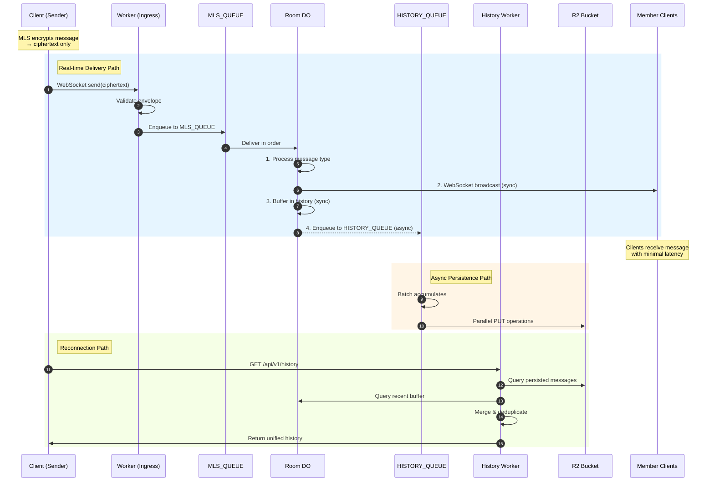

# Tunnl3d Architecture Specification  
Version: 3.1 (Cloudflare‑Native, Client‑Governed MLS)  
Revised: Client‑Side Quorum, Encrypted Metadata, Zero‑Trust Infrastructure, Async R2 History

This document defines the tunnl3d architecture as a **MLS‑secure, server‑blind messaging platform** built on Cloudflare's global edge network.  
All cryptographic authority resides in **clients**, not servers.  
Cloudflare provides **transport, routing, ordering, and persistence**, but never sees plaintext or group semantics.

---

# 1. High‑Level Overview

tunnl3d is composed of:

- **Cloudflare Workers** — ingress/egress, routing, validation of message envelopes, history API  
- **Cloudflare Queues** — ordered, durable transport for MLS messages and history persistence  
- **Cloudflare Durable Objects (DOs)** — blind coordination substrate for:
  - encrypted quorum state  
  - encrypted room metadata  
  - proposal lifecycle  
  - routing and ordering  
  - recent message buffer for low-latency history  
- **Cloudflare R2** — durable message history for client reconnection  
- **Cloudflare KV** — optional encrypted recovery blob storage  
- **Clients (WASM + MAUI)** — MLS core, encryption, quorum logic, UI, onboarding, recovery

Key properties:

- **No server‑side MLS state**  
- **No server‑side plaintext**  
- **No server‑side authority**  
- **Client‑side quorum governs membership**  
- **All sensitive metadata encrypted with MLS‑derived keys**  
- **Cloudflare is fully untrusted and replaceable**  
- **Message delivery is never blocked by persistence operations**

---

# 2. System Components

## 2.1 Worker Modules

The worker is composed of specialized modules:

| Module | Responsibility |
|--------|---------------|
| **Ingress** | WebSocket upgrades, HTTP routing, envelope validation |
| **Queue Consumer** | Delivers messages from `MLS_QUEUE` to Room DOs |
| **History Queue Consumer** | Batched writes from `HISTORY_QUEUE` to R2 |
| **History Worker** | Serves `/api/v1/history` with R2 + DO buffer merge |

## 2.2 Room Durable Object

Each room has a dedicated Durable Object that provides:

- **WebSocket session management** — hibernatable connections with session state
- **Message fan-out** — broadcasts to all connected clients in a room
- **Encrypted state storage** — room metadata, proposals, onboarding slots
- **Recent message buffer** — rolling buffer of last 50 messages for instant history

---

# 3. Data Plane

The data plane handles all ciphertext transport with a delivery-first architecture that prioritizes low-latency message delivery over persistence.

**Key features:**
- Messages delivered to clients before R2 persistence
- Dual-queue architecture separates delivery from storage
- DO buffer provides instant history for recent messages
- R2 provides durable 7-day history with batched writes

📄 **Full specification:** [data-plane.md](data-plane.md)

---

# 4. Control Plane

The control plane manages MLS control messages, proposal lifecycle, onboarding, and tenant identity—all while remaining blind to message content.

**Key features:**
- MLS proposals, commits, and GroupInfo routing
- 24-hour proposal expiration
- Three-phase server-blind onboarding

📄 **Full specification:** [control-plane.md](control-plane.md)

---

# 5. Client Governance

tunnl3d uses **client‑side quorum** for all structural changes. The server is completely blind to governance decisions.

**Key features:**
- k-of-n approval required for membership changes
- Encrypted approvals stored in DOs
- Quorum detection happens client-side
- State actor must compromise k clients

📄 **Full specification:** [client-governance.md](client-governance.md)

---

# 6. Metadata Plane

Durable Objects store encrypted room state. All sensitive metadata is encrypted client-side with MLS-derived keys before storage.

**Key features:**
- Room metadata encrypted with MLS exporter keys
- Only routing identifiers remain plaintext
- Per-epoch keys available for high-security rooms
- Cloudflare cannot decrypt any metadata

📄 **Full specification:** [metadata.md](metadata.md)

---

# 7. Security Properties

## 7.1 End‑to‑End Encryption

- MLS encrypts all application messages
- Only clients hold keys
- Cloudflare sees ciphertext only

## 7.2 Zero‑Trust Infrastructure

Cloudflare cannot:

- Decrypt messages
- Decrypt metadata
- Forge approvals
- Detect quorum
- Add ghost members
- Remove members
- Rewrite history
- Delay messages selectively (all or nothing)

## 7.3 Client‑Side Governance

- Quorum enforced cryptographically
- DO is blind to approval semantics
- State actor must compromise k clients

## 7.4 Metadata Confidentiality

- All semantic metadata encrypted
- Only routing identifiers plaintext
- History buffer contains only ciphertext

## 7.5 Forward Secrecy & PCS

MLS provides:

- Forward secrecy
- Post‑compromise security
- Epoch‑based key rotation

## 7.6 Delivery Integrity

- Messages delivered before persistence
- R2 failures don't affect delivery
- DO buffer provides backup for recent messages

---

# 8. Operational Model

## 8.1 Cloudflare Responsibilities

- Transport (WebSocket, HTTP)
- Routing (Workers)
- Ordering (Queues)
- Coordination (Durable Objects)
- Persistence (R2, KV)
- Zero plaintext handling

## 8.2 Client Responsibilities

- MLS core (encryption, decryption)
- Quorum logic (approval, verification)
- Metadata encryption
- Onboarding crypto
- Recovery crypto
- History token generation
- UI rendering

## 8.3 No Server‑Side AS

All authority resides in clients.

Cloudflare is a **stateless, untrusted substrate**.

---

# 9. Scale

tunnl3d achieves scale through architectural choices that leverage Cloudflare's global edge network.

## 9.1 Stateless Request Handling

Workers process each request independently with no shared state:

- **No coordination required** — Workers don't communicate with each other
- **Edge execution** — Requests processed at the nearest Cloudflare PoP
- **Automatic distribution** — Cloudflare routes requests globally without configuration

This means adding users in new regions requires no infrastructure changes.

## 9.2 Per-Room State Isolation

Each room is an independent Durable Object:

- **No cross-room dependencies** — Rooms operate in complete isolation
- **Automatic instantiation** — DOs created on first access, hibernated when idle
- **Location affinity** — Cloudflare migrates DOs toward active clients
- **Independent failure domains** — One room's issues don't affect others

Scale is achieved by adding rooms, not by scaling individual rooms.

## 9.3 Delivery-First Persistence

R2 writes are decoupled from message delivery:

- **Non-blocking broadcast** — Clients receive messages immediately
- **Batched writes** — History queue accumulates messages before R2 PUT
- **Failure isolation** — R2 unavailability doesn't block delivery
- **DO buffer fallback** — Recent messages available even if R2 is slow

This separation ensures delivery latency is independent of persistence latency.

## 9.4 Client-Side Computation

Heavy computation happens on clients, not infrastructure:

- **MLS cryptography** — Encryption/decryption on client devices
- **Quorum verification** — Approval counting and validation client-side
- **Metadata encryption** — Clients encrypt before sending to DOs
- **Sequence ordering** — Clients assign and reconcile sequence numbers

The server handles only routing and storage of opaque ciphertext.

## 9.5 Queue-Based Load Leveling

Queues absorb traffic spikes:

- **Buffering** — Bursts queue up rather than overwhelming DOs
- **Batching** — Consumer processes multiple messages per invocation
- **Backpressure** — Retry delays prevent cascading failures
- **Dead letter handling** — Failed messages isolated from main flow

This smooths traffic patterns and improves resilience under load.

## 9.6 Efficient Storage Patterns

Storage is optimized for the access patterns:

- **Date-partitioned R2 keys** — Enables efficient range queries by time
- **7-day retention** — Lifecycle policy prevents unbounded growth
- **Fixed-size DO buffer** — 50-message rolling buffer bounds memory
- **Ciphertext-only storage** — No parsing or indexing of message content

These patterns keep storage operations predictable regardless of message volume.

---

# 10. Complete Data Flow

---

# 11. Summary

tunnl3d on Cloudflare is:

- **Zero‑trust** — Cloudflare cannot read, modify, or selectively delay messages
- **Zero‑plaintext** — All content is opaque ciphertext
- **Zero‑API** — No authentication required beyond MLS membership
- **Client‑governed** — Quorum and authority enforced cryptographically
- **Delivery‑first** — Messages reach clients before R2 persistence
- **Economically minimal** — Batched writes, efficient queue usage
- **Resilient to state‑actor coercion** — k-of-n quorum required

**Architecture Highlights:**

| Component | Purpose | Latency Impact |
|-----------|---------|----------------|
| MLS_QUEUE | Ordered message delivery | On hot path |
| Room DO | WebSocket broadcast + buffer | On hot path |
| HISTORY_QUEUE | Async R2 persistence | Off hot path |
| History Worker | R2 + buffer merge | Query time only |
| DO Buffer | Recent 50 messages | Instant access |
| R2 | Durable 7-day history | Query time only |

Cloudflare provides global transport, coordination, and durable message storage.  
Clients provide all cryptographic correctness and governance.

This architecture achieves **maximal privacy**, **minimal delivery latency**, **maximal resilience**, and **minimal operational cost**.

---

## Related Documents

- [Data Plane](data-plane.md) — Message delivery, queues, history API
- [Control Plane](control-plane.md) — MLS control, proposals, onboarding
- [Client Governance](client-governance.md) — Quorum, approvals, membership
- [Metadata](metadata.md) — Encrypted storage, MLS-derived keys
