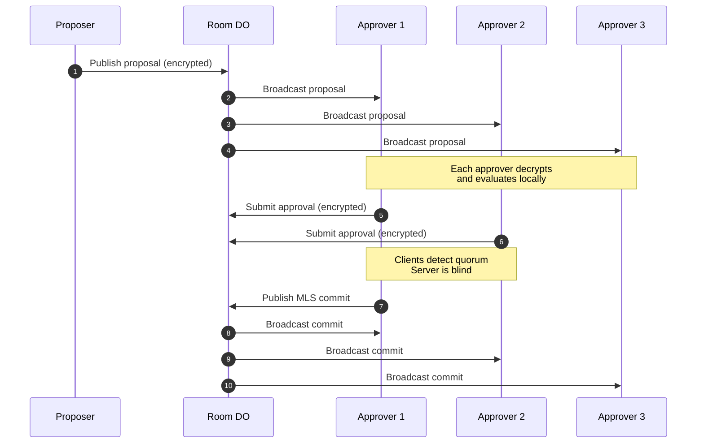

# Client Governance: Client‑Side Quorum

tunnl3d uses **client‑side quorum** for all structural changes. The server is completely blind to governance decisions—all authority resides in clients.

---

## Governed Operations

Client-side quorum is required for:

- Add member
- Remove member
- Change room configuration
- Change approver set
- Change quorum threshold

---

## Approver Set (A)

The approver set defines which members can approve structural changes:

- Defined per room
- Typically 3–7 members (normal security)
- 5–9 members (high‑security environments)
- Stored encrypted in DO (server-blind)

---

## Quorum Threshold (k)

### Default Algorithm

```
If |A| ≤ 3         → k = 2  
If |A| ∈ [4,5]     → k = 3  
If |A| ≥ 6         → k = ceil(2/3 * |A|)
```

### Whole‑Group Mode (Optional)

For rooms requiring broader consensus:

```
k = max(3, ceil(0.2 * n))
```

Where `n` is the total room membership.

---

## Quorum State

All quorum state is:

- Constructed client‑side
- Encrypted with MLS‑derived storage keys
- Stored as opaque blobs in DOs
- Never visible to Cloudflare

### Client Responsibilities

Clients:

- Fetch encrypted quorum state
- Decrypt locally
- Verify approvals cryptographically
- Detect quorum
- Publish MLS commits

### Server Blindness

Cloudflare never knows:

- Who approved
- How many approved
- When quorum is reached
- What the quorum threshold is
- Who is in the approver set

---

## Approval Flow



---

## Cryptographic Verification

Approvals are verified client-side using:

1. **MLS Signatures** — Each approval is signed by the approver's MLS credential
2. **Proposal Binding** — Approvals are cryptographically bound to specific proposals
3. **Freshness** — Timestamps prevent replay attacks
4. **Quorum Counting** — Clients independently verify k-of-n threshold

---

## Security Properties

### State Actor Resistance

To compromise governance, an attacker must:

- Compromise **k clients** simultaneously
- Not just the server infrastructure
- Not just network position

### No Ghost Members

- Server cannot add members without quorum
- All additions require k approvals
- MLS group state reflects actual membership

### No Silent Removal

- Server cannot remove members
- Removals require k approvals
- Removed members detect removal via MLS

### Audit Trail

- All proposals and approvals are stored (encrypted)
- Clients can reconstruct governance history
- Cryptographic evidence of all decisions

---

## Configuration Options

| Option | Default | Description |
|--------|---------|-------------|
| Approver set size | 3-7 | Number of members who can approve |
| Quorum threshold | Auto | Calculated from approver set size |
| Whole-group mode | Off | Require percentage of all members |
| Proposal timeout | 24h | Auto-expire unapproved proposals |
| Self-approval | Allowed | Proposer can be one of k approvers |
