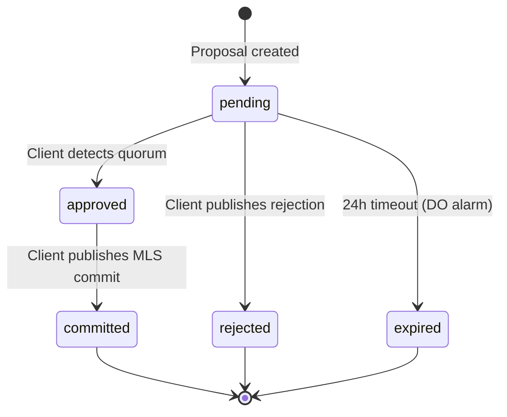

# Control Plane: Workers + Queues + Durable Objects

The control plane handles:

- MLS control messages (proposals, commits, GroupInfo)
- Quorum‑based membership changes
- Encrypted room metadata
- Proposal lifecycle

---

## MLS Control Messages

Flow:

1. Client publishes MLS control envelope (proposal, commit, GroupInfo)
2. Worker validates envelope structure (not cryptography)
3. Worker enqueues into `MLS_QUEUE`
4. Room DO processes ordered control messages:
   - Stores proposals with encrypted content
   - Updates encrypted metadata
   - Stores encrypted quorum state
   - Routes commit notifications

The DO never sees plaintext or MLS secrets.

---

## Proposal Lifecycle



Proposals are stored in DO storage with:

- `proposalId` — plaintext for routing
- `proposerPseudonymId` — for attribution
- `encryptedContent` — opaque ciphertext
- `encryptedApprovals[]` — array of approval ciphertexts
- `status` — pending, committed, rejected, expired
- `expiresAt` — automatic expiration timestamp

---

## Proposal State Machine

### States

| State | Description |
|-------|-------------|
| `pending` | Proposal created, awaiting approvals |
| `approved` | Quorum reached (client-side detection) |
| `committed` | MLS commit published |
| `rejected` | Explicitly rejected by quorum |
| `expired` | 24-hour timeout reached |

### Transitions

| From | To | Trigger |
|------|-----|---------|
| `pending` | `approved` | Client detects quorum reached |
| `pending` | `expired` | 24h timeout (DO alarm) |
| `approved` | `committed` | Client publishes MLS commit |
| `pending` | `rejected` | Client publishes rejection |

---

## Room Durable Object

Each room has a dedicated Durable Object that provides:

- **WebSocket session management** — hibernatable connections with session state
- **Message fan-out** — broadcasts to all connected clients in a room
- **Encrypted state storage** — room metadata, proposals, onboarding slots
- **Recent message buffer** — rolling buffer of last 50 messages for instant history
- **Proposal lifecycle** — stores and routes proposal state changes

### DO Storage Keys

```typescript
const STORAGE_KEYS = {
  ROOM_STATE: "room:state",
  PROPOSAL_PREFIX: "proposal:",
  ONBOARDING_PREFIX: "onboarding:",
  HISTORY_BUFFER: "history:buffer",
};
```

### Hibernatable WebSockets

The Room DO uses Cloudflare's hibernatable WebSocket API:

- Connections survive DO hibernation
- No keep-alive overhead during idle periods
- Automatic wake on incoming message
- Session state persisted in DO storage

---

## Onboarding: Three‑Phase, Client‑Side Handles

Onboarding is:

- Three‑phase
- Client‑encrypted
- Server‑blind

### Phase 1 — Client Acceptance

Client sends:

- `slot_id`
- `onboarding_public_key`
- Optional invite challenge

Workers/DOs:

- Validate `slot_id`
- Store `onboarding_public_key`
- Never see handles or PII

### Phase 2 — Admin Completion

Admin encrypts:

- Handle
- `pseudonym_id`
- Display attributes

…to the `onboarding_public_key`.

DO stores ciphertext only.

### Phase 3 — Client Finalisation

Client decrypts admin payload and joins MLS group.

Server never sees:

- Handle
- Mapping
- Onboarding secrets

---

## Tenant Identity: Billing Platform as Oracle

Billing platform stores:

- `tenant_id`
- `tenant_hmac`
- `tenant_recovery_id`

(as metadata associated with the user on account creation)

Workers validate:

1. Billing platform webhook signature
2. `tenant_hmac = HMAC(secret, tenant_id)`

No PII stored in tunnl3d.

---

## Recovery: Encrypted Blobs

Recovery blobs contain:

- Admin keys
- Pseudonym mappings
- Bootstrap metadata

Encrypted client‑side with recovery key.

Stored in KV or R2 as ciphertext.

Server never sees decrypted recovery data.
