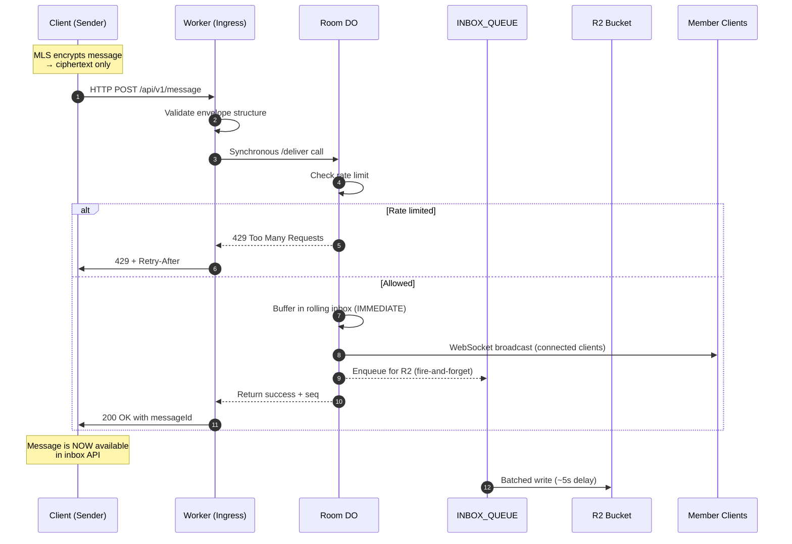
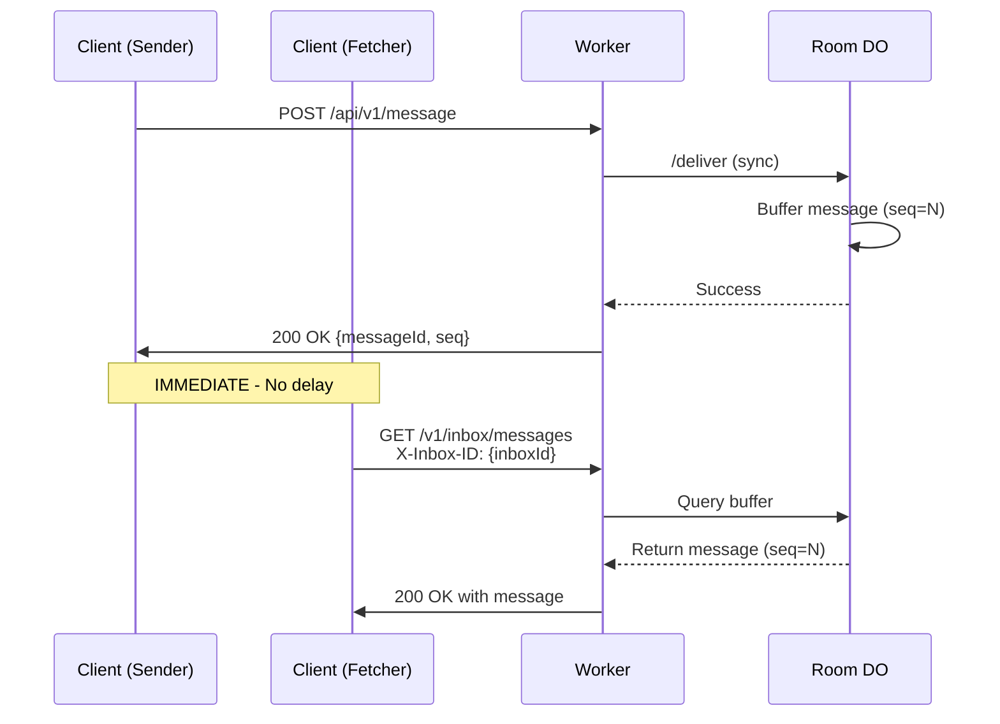
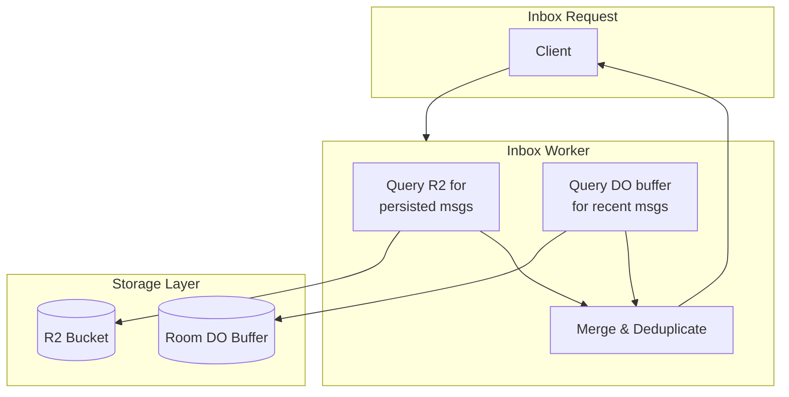
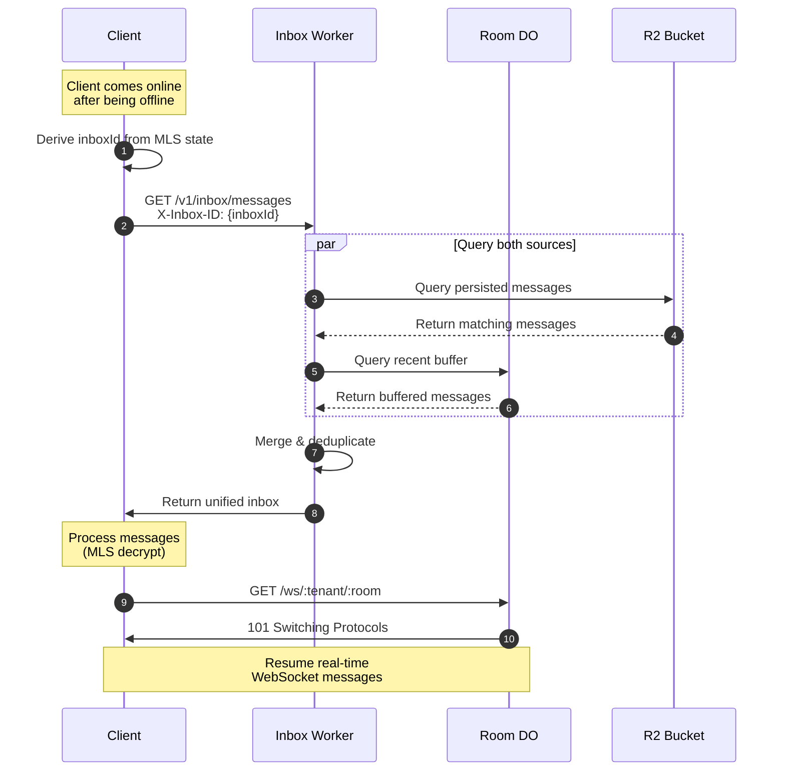

# Data Plane: Workers + Queues

The data plane handles all ciphertext transport with a focus on low-latency delivery and **instant message availability**.

---

## Application Messages

Message flow ensures **immediate inbox availability**:

1. Client encrypts message using MLS application keys
2. Worker receives ciphertext over WebSocket or HTTP
3. Worker **synchronously** delivers to Room DO
4. Room DO checks per-room rate limit
5. Room DO buffers message in rolling inbox buffer (immediate)
6. Room DO broadcasts to connected WebSocket clients (synchronous)
7. Room DO enqueues to `INBOX_QUEUE` (fire-and-forget for R2 persistence)
8. Success response returned to client

Properties:

- **Immediate availability** — messages are in the inbox buffer before HTTP response
- **Synchronous buffering** — no async gaps between submit and availability
- **Synchronous WebSocket broadcast** — connected clients receive message immediately
- **Per-room rate limiting** — prevents buffer overflow under heavy load
- **No plaintext** — server sees only ciphertext
- **No handle or identity leakage** — only pseudonym IDs in routing
- **No inter-DO communication** — each room has exactly one DO instance

---

## Rate Limiting

Each room has its own rate limiter to prevent buffer overflow and ensure fair resource allocation.

### Rate Limit Configuration

| Parameter | Value | Rationale |
|-----------|-------|-----------|
| Window | 5 seconds | Matches INBOX_QUEUE processing delay |
| Max messages | 500 | Matches DO buffer size |
| Sustained rate | 100 msg/sec | 500 messages ÷ 5 seconds |

### Overflow Guarantee

The rate limit is specifically designed to **guarantee no buffer overflow**:

```
Rate limit (500 msg / 5s) = Buffer size (500 messages)
```

Since R2 persistence has ~5 second latency via the queue, limiting to 500 messages per 5 seconds ensures that messages cannot arrive faster than they can be persisted. This provides a mathematically guaranteed protection against data loss.

### Rate Limit Responses

**HTTP POST /api/v1/message:**
```http
HTTP/1.1 429 Too Many Requests
Retry-After: 2
Content-Type: application/json

{
  "error": "Rate limit exceeded",
  "retryAfterMs": 1847
}
```

**WebSocket:**
```json
{
  "action": "error",
  "error": "Rate limit exceeded",
  "errorCode": "RATE_LIMIT_EXCEEDED"
}
```

### Sliding Window Algorithm

The rate limiter uses a sliding window algorithm:

1. Each message delivery records a timestamp
2. Timestamps older than the window (5s) are pruned
3. If count >= limit (500), request is rejected
4. Response includes precise `retryAfterMs` for efficient client backoff

The algorithm is implemented in-memory for performance, with async persistence to DO storage for durability across hibernation.

---

## Message Delivery Flow



The critical insight is that **everything happens synchronously** before returning success to the client:

- Rate limit check (fast, in-memory)
- Message is buffered in DO (immediate inbox availability)
- WebSocket broadcast to all connected clients in this room
- R2 persistence is the only async operation (fire-and-forget)

There is **no inter-DO communication**. Each room has exactly one Durable Object instance that handles all clients for that room.

---

## Queue Architecture

tunnl3d uses Cloudflare Queues for async R2 persistence:

| Queue | Purpose | Batch Size | Timeout | Retries |
|-------|---------|------------|---------|---------|
| `INBOX_QUEUE` | Async R2 persistence (off hot path) | 100 | 5s | 5 |
| `MLS_DLQ` | Dead letter queue for failed messages | — | — | — |

All message delivery happens **synchronously** via the Room DO. The queue is only used for durable R2 persistence after messages are already delivered to clients.

---

## Inbox Storage & Immediate Availability

tunnl3d guarantees **instant message availability** with a two-tier architecture:

1. **DO Buffer** — Rolling buffer of last 500 messages, populated **synchronously**
2. **R2 Inbox** — Durable persistence for full message history

### Immediate Availability Guarantee



The message is **guaranteed** to be available in inbox API responses as soon as the sender receives their 200 OK.

### Inbox Architecture



The Inbox Worker intelligently combines data from both sources:

- Always queries R2 for persisted messages
- Always queries DO buffer for recent messages
- Deduplicates by message ID (R2 messages are authoritative for seq)
- Returns sorted, unified results

### DO Rolling Buffer

The Room DO maintains a rolling buffer of the 500 most recent messages:

```typescript
interface BufferedInboxEntry {
  seq: number;            // Sequence number
  messageId: string;      // Message ID
  ciphertext: string;     // MLS-encrypted payload
  envelope: AnyEnvelope;  // Full envelope for internal use
  bufferedAt: string;     // When buffered in DO
}
```

Buffer properties:

| Property | Value |
|----------|-------|
| Size | 500 messages |
| Eviction | FIFO (oldest removed when full) |
| Latency | Immediate (synchronous write) |
| Durability | Transient (backed by R2 for durability) |
| Population | **Synchronous** during /deliver |

The buffer is populated **synchronously** during the HTTP request, before returning success. This is the key to instant availability.

### Idempotency

The `/deliver` endpoint is idempotent:

- If a message with the same `messageId` already exists in the buffer, it returns the existing `seq`
- This prevents duplicate messages from concurrent requests
- Clients can safely retry failed requests

### R2 Persistent Storage

Messages are durably persisted to R2 via the `INBOX_QUEUE`:

#### R2 Key Structure

```
inbox/{inboxId}/{seq:010d}-{messageId}.json
```

Example:
```
inbox/tenant-123:room-456/0000000042-msg-abc123.json
```

#### Storage Properties

| Property | Value |
|----------|-------|
| Write timing | Async (via INBOX_QUEUE, ~5s delay) |
| Durability | High (R2 replication) |
| Default retention | 7 days |
| Auto-expiration | Lifecycle policy |

---

## Inbox API

The Inbox Worker serves the inbox endpoints for message retrieval. The `inboxId` is passed via the `X-Inbox-ID` header to keep the capability token out of HTTP access logs.

📄 **Full specification:** [inbox-api.md](inbox-api.md)

### Fetch Messages

**Endpoint:** `GET /v1/inbox/messages`

**Headers:**

| Header | Type | Required | Description |
|--------|------|----------|-------------|
| `X-Inbox-ID` | string | Yes | Opaque room inbox identifier |

**Query Parameters:**

| Parameter | Type | Required | Description |
|-----------|------|----------|-------------|
| `fromSeq` | integer | No | Start from this sequence number (default: 0) |
| `limit` | integer | No | Max messages (default: 100, max: 1000) |

**Response:**

```json
{
  "messages": [
    {
      "seq": 42,
      "messageId": "msg-abc123",
      "ciphertext": "base64url-encoded-content",
      "createdAt": "2024-12-23T10:05:00.000Z"
    }
  ],
  "nextSeq": 43
}
```

### Append Message

**Endpoint:** `POST /v1/inbox/append`

**Headers:**

| Header | Type | Required | Description |
|--------|------|----------|-------------|
| `X-Inbox-ID` | string | Yes | Opaque room inbox identifier |

Used for direct inbox writes (bypassing the Room DO flow).

**Request Body:**

```json
{
  "messageId": "msg-abc123",
  "ciphertext": "base64url-encoded-content"
}
```

**Response:**

```json
{
  "seq": 42,
  "storedAt": "2024-12-23T10:05:00.000Z"
}
```

---

## Client Reconnection Flow

When a client reconnects after being offline:



### Edge Cases

| Scenario | Handling |
|----------|----------|
| **Duplicate messages** | Deduplicated by messageId |
| **Out-of-order messages** | Server sorts by seq |
| **Message in buffer but not R2** | Merge includes buffer messages |
| **R2 unavailable** | DO buffer provides recent messages |
| **Concurrent senders** | DO buffer is atomic, seq is monotonic |

---

## Inbox Security

### Access Control

The `inboxId` is a capability token derived from MLS group state:

```typescript
// Client-side derivation (all members compute identical inboxId)
const inboxKey = await mlsGroup.export("tunnl3d-inbox-key", roomId, 32);
const inboxId = base64(hmacSha256(inboxKey, "inbox-id"));
```

**Security Properties:**

| Property | Guarantee |
|----------|-----------|
| **Authentication** | Only room members can derive the inboxId |
| **Authorization** | Knowledge of inboxId grants access |
| **Opacity** | Relay cannot correlate inboxId to room or tenant |
| **Zero-trust** | Relay stores only ciphertext |

---

## Message Retention & Lifecycle

### Default Retention Policy

- Messages older than 7 days are automatically deleted
- Configurable per tenant via lifecycle rules

### R2 Lifecycle Configuration

```json
{
  "rules": [
    {
      "id": "expire-old-inbox-messages",
      "enabled": true,
      "conditions": {
        "prefix": "inbox/"
      },
      "actions": {
        "expiration": {
          "days": 7
        }
      }
    }
  ]
}
