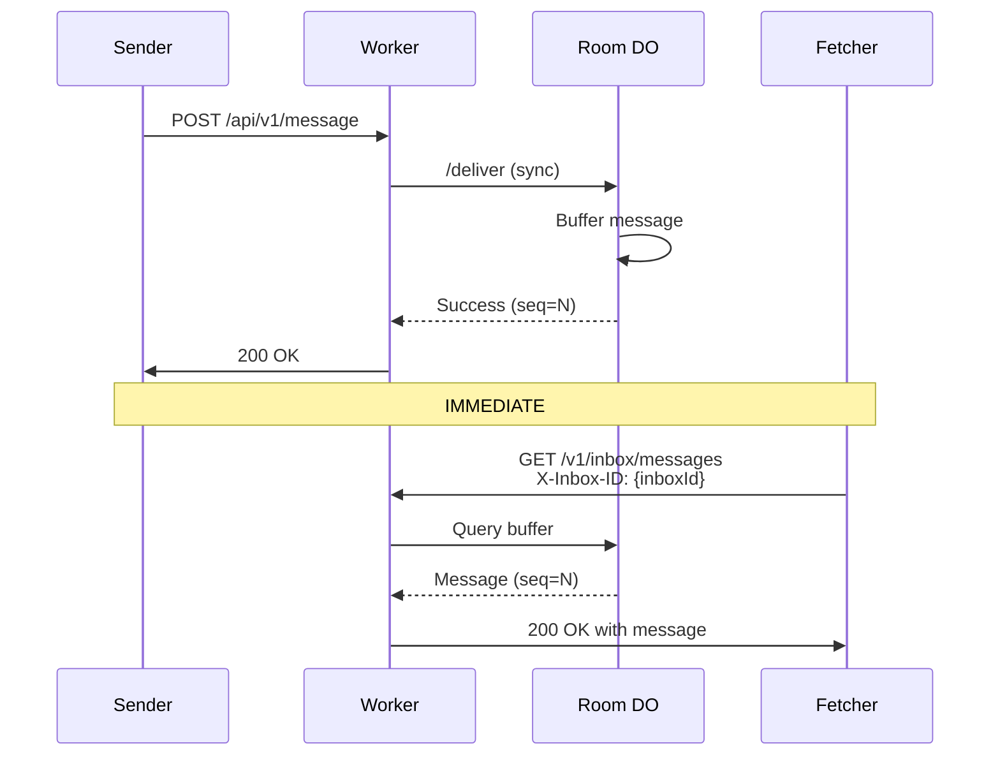

# Inbox API Specification

The Inbox API provides per-room message storage for offline recovery and async message delivery. Each room has a single inbox identified by an opaque `inboxId` derived from MLS group state.

**Security Note:** The `inboxId` is passed via the `X-Inbox-ID` header rather than the URL path. This keeps the capability token out of standard HTTP access logs, CDN logs, and proxy logs.

---

## 1. Immediate Availability Guarantee

**Messages are available IMMEDIATELY after submission.** When a client sends a message via `POST /api/v1/message`, the message is synchronously buffered in the Room Durable Object before the HTTP response is returned. This guarantees that any subsequent `GET /v1/inbox/messages` call will include that message.



**No polling delays required** — messages are available with zero latency after the sender receives their success response.

---

## 2. Resource Model

### inboxId

- Opaque identifier derived deterministically from MLS group state
- All group members compute the identical `inboxId` for their shared room
- Format: base64url-encoded 256-bit value (or `tenant:room` for internal routing)
- Reveals nothing about room, tenant, or membership to the relay
- **Passed via `X-Inbox-ID` header** to avoid logging in URL paths

**Derivation:**

```typescript
// All members derive the same inboxId from MLS state
const inboxKey = await mlsGroup.export("tunnl3d-inbox-key", roomId, 32);
const inboxId = base64url(hmacSha256(inboxKey, "inbox-id"));
```

### Inbox Entry

Each entry in an inbox represents one MLS-encrypted message:

| Field | Type | Description |
|-------|------|-------------|
| `seq` | integer | Monotonically increasing sequence number per inbox |
| `messageId` | string | Client-generated stable identifier for deduplication |
| `ciphertext` | string | MLS-encrypted payload (base64url-encoded) |

**Note:** No server-side timestamp is stored. The async queue processing provides natural timing obfuscation. Any display timestamps should be included inside the MLS-encrypted envelope by clients.

---

## 3. Storage Architecture

The inbox uses a two-tier storage architecture for immediate availability and durability:

| Tier | Storage | Latency | Durability | Capacity |
|------|---------|---------|------------|----------|
| **DO Buffer** | Room Durable Object | Immediate | Transient | 500 messages |
| **R2 Inbox** | R2 Bucket | ~5s delay | Permanent | Unlimited |

### Message Flow

1. Message submitted via `POST /api/v1/message`
2. Worker **synchronously** delivers to Room DO
3. Room DO buffers message (immediate availability)
4. Room DO enqueues to `INBOX_QUEUE` (async R2 write)
5. Worker returns success to client
6. Queue consumer writes to R2 (~5s later)

### Fetch Behavior

The inbox API queries both tiers and merges results:

- R2 provides historical/durable messages
- DO buffer provides recent messages (may not be in R2 yet)
- Deduplication by `messageId` (R2 is authoritative)
- Results sorted by `seq`

---

## 4. Fetch Messages

Retrieves an ordered batch of messages from an inbox.

**Endpoint:**

```
GET /v1/inbox/messages
```

**Headers:**

| Header | Type | Required | Description |
|--------|------|----------|-------------|
| `X-Inbox-ID` | string | Yes | Opaque room inbox identifier |

**Query Parameters:**

| Parameter | Type | Required | Default | Description |
|-----------|------|----------|---------|-------------|
| `fromSeq` | integer | No | 0 | Return entries where `seq >= fromSeq` |
| `limit` | integer | No | 100 | Maximum entries to return (max: 1000) |

**Example Request:**

```http
GET /v1/inbox/messages?fromSeq=0&limit=100
X-Inbox-ID: dGVuYW50LTEyMzpyb29tLTQ1Ng==
```

**Response:**

```json
{
  "messages": [
    {
      "seq": 42,
      "messageId": "msg-abc123",
      "ciphertext": "base64url-encoded-blob"
    }
  ],
  "nextSeq": 43
}
```

| Field | Description |
|-------|-------------|
| `messages` | Array of inbox entries, sorted ascending by `seq` |
| `nextSeq` | Suggested `fromSeq` for subsequent fetches (typically `max(seq) + 1`) |

**Error Responses:**

| Status | Description |
|--------|-------------|
| 400 | Missing `X-Inbox-ID` header, invalid `fromSeq` or `limit` |
| 429 | Rate limited |
| 500 | Internal server error |

---

## 5. Append Message

Appends a new message directly to the inbox (bypasses Room DO flow).

**Note:** For normal message sending, use `POST /api/v1/message` which provides WebSocket broadcast. Use this endpoint only for direct inbox writes.

**Endpoint:**

```
POST /v1/inbox/append
```

**Headers:**

| Header | Type | Required | Description |
|--------|------|----------|-------------|
| `X-Inbox-ID` | string | Yes | Opaque room inbox identifier |
| `Content-Type` | string | Yes | Must be `application/json` |

**Request Body:**

```json
{
  "messageId": "string",
  "ciphertext": "base64url-encoded-blob"
}
```

**Example Request:**

```http
POST /v1/inbox/append
X-Inbox-ID: dGVuYW50LTEyMzpyb29tLTQ1Ng==
Content-Type: application/json

{
  "messageId": "msg-abc123",
  "ciphertext": "YmFzZTY0LWVuY29kZWQtY2lwaGVydGV4dA=="
}
```

**Response:**

```
Status: 202 Accepted
```

```json
{
  "seq": 42
}
```

**Idempotency:**

- If an entry with the same `messageId` already exists, the relay returns the existing `seq` without creating a duplicate.

---

## 6. Retention

Messages are retained based on time-to-live (TTL):

- **Default retention:** 7 days
- **Automatic expiration:** R2 lifecycle policy deletes expired entries (based on R2 object age, not message metadata)
- **No acknowledgment required:** Clients are responsible for fetching before TTL expiration

### Client Considerations

- Clients must periodically sync to avoid missing messages removed by TTL
- Treat the inbox as a best-effort recovery mechanism, not permanent storage
- For real-time delivery, use the WebSocket path

---

## 7. Security Properties

### Metadata Minimization

The relay sees only:

- `inboxId` (opaque, unlinkable to room or tenant, **not logged in URL**)
- `messageId` (opaque)
- `ciphertext` (encrypted, opaque)
- `seq` (operational metadata for ordering)

The relay cannot determine:

- Which tenant owns the inbox
- Which room the inbox belongs to
- Group membership or size
- Message content or type
- Sender or recipient identities
- Per-message timing (R2 write time is obfuscated by async queue batching)

### Access Control

- `inboxId` is a capability: knowledge of the `inboxId` grants read/write access
- Only MLS group members can derive the `inboxId`
- The derivation uses MLS exporter keys, ensuring cryptographic binding to group membership
- `inboxId` passed via header to minimize exposure in logs

---

## 8. Integration with Real-Time Delivery

The Inbox API complements real-time WebSocket delivery:

| Path | Use Case | Latency |
|------|----------|---------|
| **WebSocket** | Online clients, real-time messaging | Sub-second |
| **Inbox API** | Offline recovery, missed message sync | Immediate (after send) |

### Client Reconnection Flow

1. Client reconnects after being offline
2. Client derives `inboxId` from MLS group state
3. Client fetches from inbox using last known `seq` (via `X-Inbox-ID` header)
4. Client processes missed messages (MLS decrypt)
5. Client resumes real-time WebSocket connection

### Deduplication

Messages may be received via both paths. Clients deduplicate by `messageId`:

- Track received `messageId` values locally
- Skip processing if already received via WebSocket

---

## 9. Rate Limiting

| Limit | Value |
|-------|-------|
| Append requests per minute per inboxId | 120 |
| Fetch requests per minute per inboxId | 60 |
| Max messages per fetch | 1000 |

---

## 10. Summary

The Inbox API provides:

- **Immediate availability** — messages available with zero delay after send
- **Two-tier storage** — DO buffer for instant access, R2 for durability
- **Per-room inboxes** with opaque identifiers
- **Header-based inboxId** — capability token kept out of URL logs
- **Seq-based ordered retrieval** with pagination
- **TTL-based retention** (no ack complexity)
- **Minimal metadata exposure** to the relay (no per-message timestamps)
- **Timing obfuscation** — async queue batching obscures individual message timing
- **Seamless integration** with real-time WebSocket delivery

All group semantics, membership knowledge, and encryption remain client-side. The relay is a blind, stateless storage substrate.
